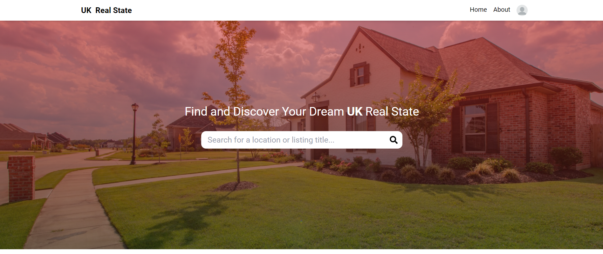
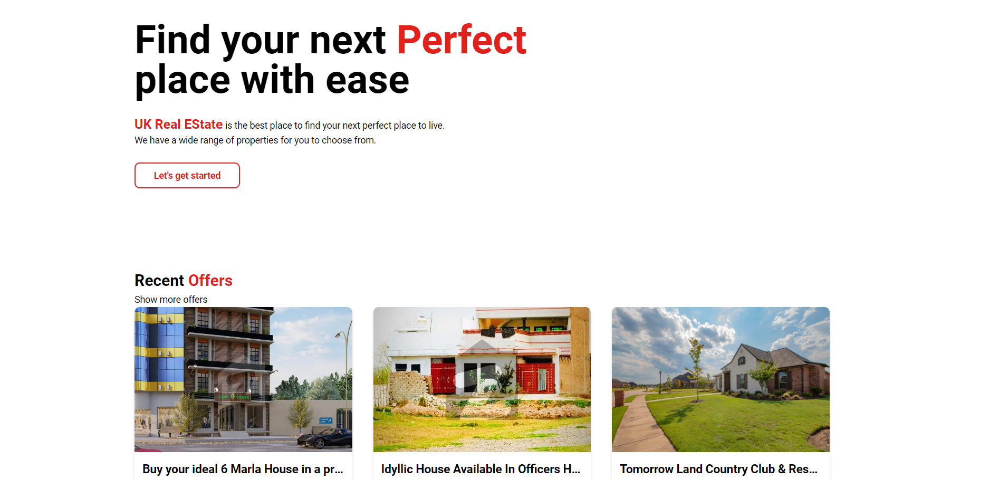

# MERN UK Real Estate Management Website

This is a **full-stack Real Estate Management** application built using the **MERN stack (MongoDB, Express, React, Node.js)**, styled with **Tailwind CSS**, and state management is handled with **Redux Toolkit**.

## Table of Contents

- [Technologies Used](#technologies-used)
- [Features](#features)
- [Folder Structure](#folder-structure)
- [Scripts](#scripts)
- [Installation](#installation)
- [Environment Variables](#environment-variables)
- [How to Run](#how-to-run)
- [License](#license)

## Technologies Used

- **Frontend**: React.js, Tailwind CSS, Redux Toolkit
- **Backend**: Node.js, Express.js, MongoDB (with Mongoose)
- **State Management**: Redux Toolkit
- **Styling**: Tailwind CSS
- **Authentication**: JSON Web Tokens (JWT)
- **File Storage**: Firebase Storage

## Features

- **Authentication**: Register and login functionality with JWT.
- **Real Estate Listings**: Users can view, create, update, and delete property listings.
- **Image Upload**: Upload property images to Firebase Storage.
- **Profile Management**: Update user profile details, including uploading avatars.
- **Responsive Design**: Fully responsive user interface using Tailwind CSS.
- **Admin Panel**: Manage users, properties, and other administrative tasks.

## Folder Structure

```bash
.
├── client              # React frontend
├── controllers         # Backend controllers (business logic)
├── errors              # Custom error handling
├── middleware          # Middleware for routes (authentication, validation)
├── models              # Mongoose models for MongoDB
├── node_modules        # Node dependencies
├── routes              # API routes (for authentication, listings, etc.)
├── utils               # Utility functions (helper methods, JWT, etc.)
├── .env                # Environment variables
├── .gitignore          # Ignored files in version control
├── example.env         # Example environment variable configuration
├── package-lock.json   # Package-lock for npm
├── package.json        # Project dependencies and scripts
├── README.md           # Project README
└── server.js           # Entry point for the Node.js backend
```

## Clone the Repositery:

```bash
git clone https://github.com/UzairKhan313/mern-real-state.git
```

## Note :

Rename and the Example.env file to just .env root directory and the client director and provide the following variables.

## Install All the Dependency in Both side:

```bash
npm run setup-project
```

## Run the Development Server:

```bash
npm run dev
```

## Project Preview






